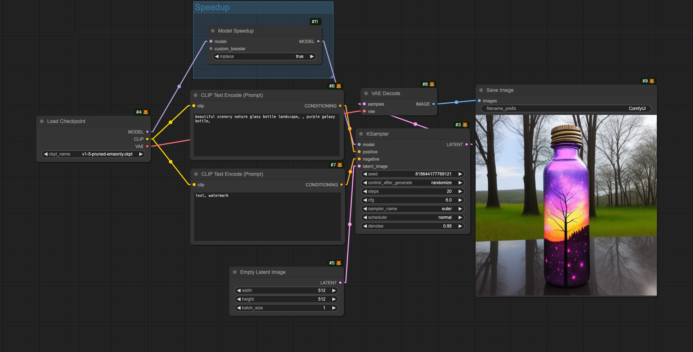

Just a subfolder of https://github.com/siliconflow/onediff

## Installation
### (Optional) Installing through comfy cli
```shell
pip install comfy-cli

# Installing ComfyUI https://github.com/Comfy-Org/comfy-cli?tab=readme-ov-file#installing-comfyui
comfy install

comfy node install onediff_comfy_nodes # default install oneflow backend
```
### (Optional) Installing through github
```shell
git clone https://github.com/siliconflow/onediff.git
cd onediff && pip install -e .
ln -s $(pwd)/onediff_comfy_nodes path/to/ComfyUI/custom_nodes/
# or
# cp -r onediff_comfy_nodes path/to/ComfyUI/custom_nodes/
```

- Install-a-compiler-backend
    https://github.com/siliconflow/onediff?tab=readme-ov-file#install-a-compiler-backend

## Quick Start

Start the comfyui service:
```shell
comfy launch -- --gpu-only 
```

The following image is a loadable workflow file
